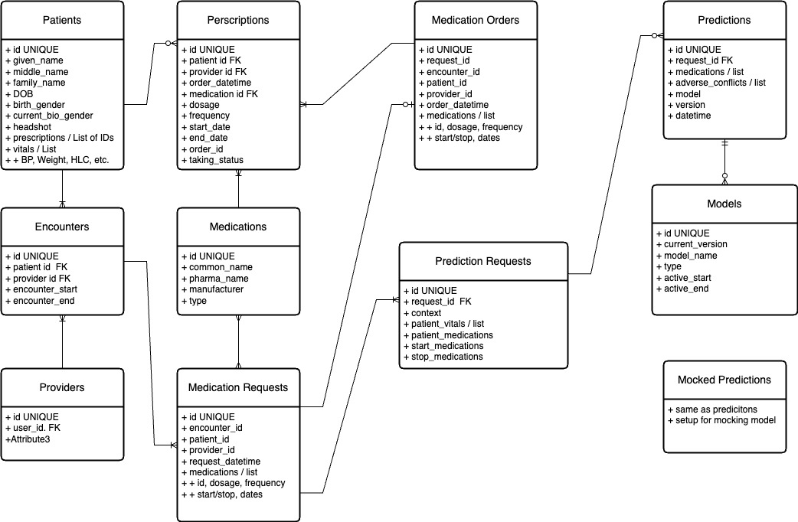

# Data Model - Phase 1

Entities:
- Encounter -  Anytime a health care provider and a patient interact (for purposes of care)
- Patient -  A single human being that has an EMR/EHR tracked in the system and gets care through encounters (and more, but not for my project).
- Provider - A single human being that is provides care to a patient during an encounter.
- Prescriptions - 0 to many medications prescribed to the patient
- Medication Request - The medication being prescribed, current medications, and other info relevant to making the drug-drug interaction prediction
- Prediction Requests - Request to evaluate predictions for drug-drug interactions.
- Predictions - The actual prediction of drug-drug interactions generated per each Medication Request.
- Medication Order -  An order for a patient to take a medication.  (Prescriptions)
    note: if provider heads warning, the medication order will not have the drug from the request
    OR a current drug patient is on will be removed by request / order as well?
- Medications - reference table of medications and relevant EMR/EHR details about them.

Relationships:
- Encounter has a Patient and a Provider
- Encounter has one or more Medication Request(s)
- Medication Request is from one Provider for one Patient
- Medication Request is for 1 to many Medications
- Patient has 0 to many Patient Medications
- Medication Request generates 1 Prediction
  - Prediction can contain one or more adverse warnings
- Medication Request has 0 to 1 Medication Order
- A Prediction is made by 1 ML Model

Model Data Store:
- ML Models - Detailed info about drug-drug interaction ml models in the system
- Mocked Predictions - Predictions mocked for demo until integration phase with AI/ML API.

# Data Model - Target State (WIP)

My API will be sending JSON messages that contain Resources/Objects and their associated data defined by the FHIR specification.
I want it to be interoperable OOB for any system / user that adheres to the FHIR specification.
Data Model will need to support translation between data in transit and data at rest if I capture the data in a different specification.
Securing data will be a primary concern, but how and when/where will not be defined in the high-level data model.

Draft 1.0

