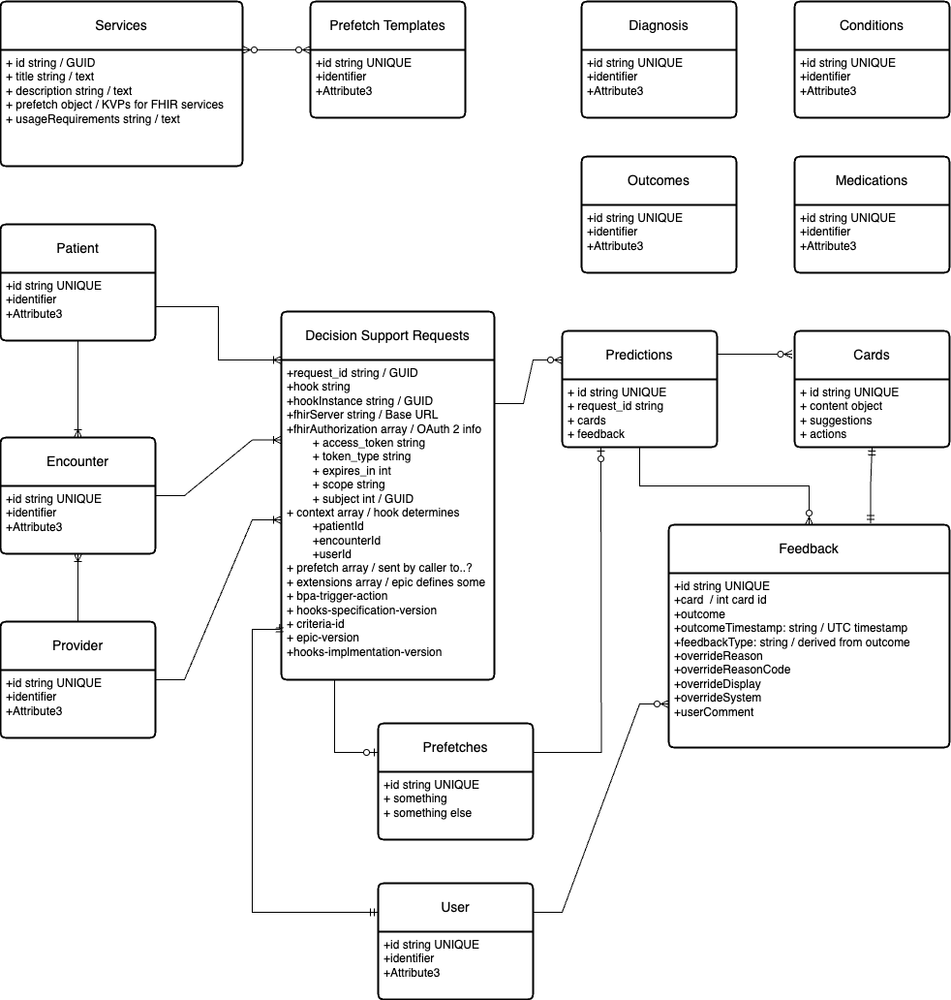

# Data Model - Target State

My API will be sending JSON messages that contain Resources/Objects and their associated data defined by the FHIR specification.
I want it to be interoperable OOB for any system / user that adheres to the FHIR specification.
Data Model will need to support translation between data in transit and data at rest if I capture the data in a different specification.
Securing data will be a primary concern, but how and when/where will not be defined in the high-level data model.

Draft 1.0

# Data Model - Phase 1

Encounter:
    - id
    - patient id
    - provider id
    - medicationRequests object 

Medications:

Providers
Patients
MedicationRequests

